# CopadoCon-2026-Hackathon
Dream - Think - Build

Here is the complete step-by-step workflow of Copado Phantom.

[ Developer ] --( git commit / push )--> [ Local Git Hooks ]

                                                |
                                      (Intercepts Action)
                                                v
                                    [ Copado Phantom Daemon ]
                                     (Go Backend + BoltDB)
                                                |
         +--------------------------------------+----------------------------------+

         |                                      |                                  |
         v                                      v                                  v
 [ Terminal UI ]                       [ Dual MCP Server ]                [ Copado Cloud APIs ]
(Bubble Tea Dashboard)                (Claude / Cursor AI)              (REST / Dialogue / CRT)

         |                                      |                                  |
         v                                      v                                  v
Displays live status.                  AI assists with errors.            Runs tests & syncs stories.

------------------------------
## 1. The Trigger Phase

* 💻 Developer writes code inside their editor.
* ⌨️ Developer types git commit or git push.
* ⚓ Native Git Hooks instantly intercept this command.
* 🛑 The command pauses before sending to GitHub.

------------------------------
## 2. The Processing Phase

* 👻 Copado Phantom Daemon wakes up locally.
* 💾 It checks local data using BoltDB.
* 🌐 It establishes a silent cloud connection.

------------------------------
## 3. The Execution Phase (Parallel)

* 📊 Terminal UI opens a live dashboard automatically.
* 🤖 MCP Server feeds context to Claude/Cursor.
* ☁️ Copado APIs run compliance tests remotely.

------------------------------
## 4. The Resolution Phase

* ✅ Automated checks pass successfully.
* 🚀 Git command finishes its execution.
* 🖥️ Code pushes safely to the repository.

------------------------------


# Phase 1: Project Initialization & Go Daemon Core

Let's build this ground-up, one file at a time. I'll explain every decision.

  


---

## Step 1: Folder Structure

Create this directory tree manually first. Nothing gets written to it yet — just `mkdir` everything so Go's tooling is happy from the start.

```
copado-phantom/
├── README.md
├── SKILL.md                          ← (Phase 4, placeholder for now)
├── Makefile
├── go.mod
├── go.sum
├── phantom.toml.example
│
├── cmd/
│   ├── phantom/
│   │   └── main.go                   ← Daemon entrypoint
│   └── phantom-cli/
│       └── main.go                   ← CLI called by Git hooks
│
├── internal/
│   ├── config/
│   │   └── config.go                 ← TOML config loader
│   ├── state/
│   │   ├── cache.go                  ← BoltDB wrapper
│   │   └── schema.go                 ← Bucket names + typed keys
│   ├── ipc/
│   │   ├── server.go                 ← Unix socket server (daemon)
│   │   └── client.go                 ← Unix socket client (CLI)
│   ├── copado/                       ← Phase 3
│   ├── dialogue/                     ← Phase 3
│   ├── crt/                          ← Phase 3
│   ├── hooks/                        ← Phase 2
│   └── tui/                          ← Phase 5
│
├── mcp-server/                       ← Phase 4 (TypeScript/Bun)
│   ├── index.ts
│   ├── package.json
│   └── tools/
│
└── scripts/
    ├── install-hooks.sh
    └── uninstall.sh
```

Run this to create it all at once:

```bash
mkdir -p copado-phantom/{cmd/{phantom,phantom-cli},internal/{config,state,ipc,copado,dialogue,crt,hooks,tui},mcp-server/tools,scripts}
cd copado-phantom
```

---

